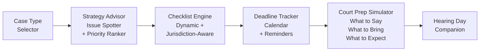

# Pro Se Assistant Toolkit

**Help self-represented litigants win.**

## The Problem

Over 80% of family court cases involve at least one unrepresented party. These litigants face impossible complexity -- byzantine procedures, unfamiliar legal terminology, strict deadlines, and high-stakes outcomes -- with no guidance. The system was designed for lawyers, and without one, most people are set up to fail.

## The Solution

The Pro Se Assistant Toolkit provides case strategy guidance, smart checklists, deadline tracking, and a court preparation simulator. It meets self-represented litigants where they are and walks them through every step -- from identifying their case type to walking into the courtroom prepared.



## Who This Helps

- **Self-represented litigants** -- the 80%+ of family court participants without attorneys
- **Court self-help centers** looking for digital tools to extend their reach
- **Legal aid triage staff** who need to quickly orient new clients
- **Law school clinics** training students while serving real communities

## Real Story

**A custody modification — navigated step by step.**

A parent receives notice that a custody modification hearing has been scheduled six weeks out. Working full-time with no attorney and no prior court experience, the stakes are clear: show up prepared, or risk an outcome that shapes the children's lives for years.

Here's how the toolkit helps at every stage:

**Week 1 — Understand the situation**
- Case type selector identifies this as a *custody modification* (not an initial filing)
- Strategy advisor surfaces the two key legal standards: changed circumstances and best interest of the child
- Jurisdiction-specific checklist generated — 14 items, ordered by deadline

**Weeks 2–4 — Build the record**
- Gather school records, medical records, and communication logs
- Complete the required financial disclosure form
- Draft the parenting plan modification proposal
- Deadline tracker fires reminders 14 days, 7 days, and 48 hours before each filing window

**Week 5 — Court prep**
- Court prep simulator loads custody-specific practice questions
- Feedback surfaces unclear answers and suggests more child-focused language
- Day-of checklist generated: what to bring, where to sit, how to address the judge

**Hearing day**
- Filed correctly. Filed on time. Ready to speak clearly to the facts.

The outcome is never guaranteed — no tool can promise that. But arriving organized, having met every deadline, and knowing what to expect removes the biggest risk factor for self-represented litigants: avoidable procedural errors.

> *This is a representative scenario for illustration only. It is not legal advice.*

---

## Features

- **Case type identification and strategy guidance** -- understand your situation and what to prioritize
- **Dynamic checklists by jurisdiction and case type** -- never miss a required document or step
- **Deadline tracking with calendar integration** -- stay on top of filing windows and court dates
- **Court preparation simulator** with practice Q&A -- rehearse before the real thing
- **"Day of court" companion checklist** -- what to bring, what to wear, what to expect
- **Plain-language legal explanations** -- no legalese, just clear answers

## Quick Start

```bash
git clone https://github.com/dougdevitre/pro-se-toolkit.git
cd pro-se-toolkit
npm install
npm run dev
```

### Usage Example

```typescript
import { ChecklistEngine } from '@justice-os/pro-se-toolkit/checklists/engine';
import { CourtPrepSimulator } from '@justice-os/pro-se-toolkit/court-prep/simulator';

// Generate a jurisdiction-specific checklist
const engine = new ChecklistEngine();
const checklist = await engine.generate('custody-modification', 'MO');

console.log(`${checklist.length} items generated`);
engine.markComplete(checklist[0].id);

const validation = engine.validate();
console.log(`Filing ready: ${validation.ready}`);

// Practice for court
const sim = new CourtPrepSimulator();
await sim.load('custody');

const question = sim.getCurrentQuestion();
console.log(question?.question);

const result = sim.submitAnswer('Your Honor, circumstances have changed...');
console.log(result.feedback);

// Get the day-of checklist
const dayOf = sim.getDayOfChecklist();
```

See [`examples/family-court-checklist.ts`](./examples/family-court-checklist.ts) for a complete walkthrough.

## Roadmap

| Feature | Status |
|---------|--------|
| Case type identification and strategy guidance | Done |
| Dynamic checklists by jurisdiction and case type | In Progress |
| Deadline tracking with calendar integration | In Progress |
| Court preparation simulator with practice Q&A | Planned |
| Day-of-court companion checklist | Planned |
| Plain-language legal explanations library | Planned |

## Architecture

See [`docs/architecture.md`](./docs/architecture.md) for detailed Mermaid diagrams covering case flow, checklist generation, deadline tracking, and court prep simulation.

## Contributing

See [CONTRIBUTING.md](./CONTRIBUTING.md) for guidelines.

## License

MIT -- see [LICENSE](./LICENSE) for details.

---

## Justice OS Ecosystem

This repository is part of the **Justice OS** open-source ecosystem — 32 interconnected projects building the infrastructure for accessible justice technology.

### Core System Layer
| Repository | Description |
|-----------|-------------|
| [justice-os](https://github.com/dougdevitre/justice-os) | Core modular platform — the foundation |
| [justice-api-gateway](https://github.com/dougdevitre/justice-api-gateway) | Interoperability layer for courts |
| [legal-identity-layer](https://github.com/dougdevitre/legal-identity-layer) | Universal legal identity and auth |
| [case-continuity-engine](https://github.com/dougdevitre/case-continuity-engine) | Never lose case history across systems |
| [offline-justice-sync](https://github.com/dougdevitre/offline-justice-sync) | Works without internet — local-first sync |

### User Experience Layer
| Repository | Description |
|-----------|-------------|
| [justice-navigator](https://github.com/dougdevitre/justice-navigator) | Google Maps for legal problems |
| [mobile-court-access](https://github.com/dougdevitre/mobile-court-access) | Mobile-first court access kit |
| [cognitive-load-ui](https://github.com/dougdevitre/cognitive-load-ui) | Design system for stressed users |
| [multilingual-justice](https://github.com/dougdevitre/multilingual-justice) | Real-time legal translation |
| [voice-legal-interface](https://github.com/dougdevitre/voice-legal-interface) | Justice without reading or typing |
| [legal-plain-language](https://github.com/dougdevitre/legal-plain-language) | Turn legalese into human language |

### AI + Intelligence Layer
| Repository | Description |
|-----------|-------------|
| [vetted-legal-ai](https://github.com/dougdevitre/vetted-legal-ai) | RAG engine with citation validation |
| [justice-knowledge-graph](https://github.com/dougdevitre/justice-knowledge-graph) | Open data layer for laws and procedures |
| [legal-ai-guardrails](https://github.com/dougdevitre/legal-ai-guardrails) | AI safety SDK for justice use |
| [emotional-intelligence-ai](https://github.com/dougdevitre/emotional-intelligence-ai) | Reduce conflict, improve outcomes |
| [ai-reasoning-engine](https://github.com/dougdevitre/ai-reasoning-engine) | Show your work for AI decisions |

### Infrastructure + Trust Layer
| Repository | Description |
|-----------|-------------|
| [evidence-vault](https://github.com/dougdevitre/evidence-vault) | Privacy-first secure evidence storage |
| [court-notification-engine](https://github.com/dougdevitre/court-notification-engine) | Smart deadline and hearing alerts |
| [justice-analytics](https://github.com/dougdevitre/justice-analytics) | Bias detection and disparity dashboards |
| [evidence-timeline](https://github.com/dougdevitre/evidence-timeline) | Evidence timeline builder |

### Tools + Automation Layer
| Repository | Description |
|-----------|-------------|
| [court-doc-engine](https://github.com/dougdevitre/court-doc-engine) | TurboTax for legal filings |
| [justice-workflow-engine](https://github.com/dougdevitre/justice-workflow-engine) | Zapier for legal processes |
| [pro-se-toolkit](https://github.com/dougdevitre/pro-se-toolkit) | Self-represented litigant tools |
| [justice-score-engine](https://github.com/dougdevitre/justice-score-engine) | Access-to-justice measurement |
| [justice-app-generator](https://github.com/dougdevitre/justice-app-generator) | No-code builder for justice tools |

### Quality + Testing Layer
| Repository | Description |
|-----------|-------------|
| [justice-persona-simulator](https://github.com/dougdevitre/justice-persona-simulator) | Test products against real human realities |
| [justice-experiment-lab](https://github.com/dougdevitre/justice-experiment-lab) | A/B testing for justice outcomes |

### Adoption Layer
| Repository | Description |
|-----------|-------------|
| [digital-literacy-sim](https://github.com/dougdevitre/digital-literacy-sim) | Digital literacy simulator |
| [legal-resource-discovery](https://github.com/dougdevitre/legal-resource-discovery) | Find the right help instantly |
| [court-simulation-sandbox](https://github.com/dougdevitre/court-simulation-sandbox) | Practice before the real thing |
| [justice-components](https://github.com/dougdevitre/justice-components) | Reusable component library |
| [justice-dev-starter-kit](https://github.com/dougdevitre/justice-dev-starter-kit) | Ultimate boilerplate for justice tech builders |

> Built with purpose. Open by design. Justice for all.


---

### ⚠️ Disclaimer

This project is provided for **informational and educational purposes only** and does **not** constitute legal advice, legal representation, or an attorney-client relationship. No warranty is made regarding accuracy, completeness, or fitness for any particular legal matter. **Always consult a licensed attorney** in your jurisdiction before making legal decisions. Use of this software does not create any professional-client relationship.

---

### Built by Doug Devitre

I build AI-powered platforms that solve real problems. I also speak about it.

**[CoTrackPro](https://cotrackpro.com)** · admin@cotrackpro.com

→ **Hire me:** AI platform development · Strategic consulting · Keynote speaking

> *AWS AI/Cloud/Dev Certified · UX Certified (NNg) · Certified Speaking Professional (NSA)*
> *Author of Screen to Screen Selling (McGraw Hill) · 100,000+ professionals trained*
