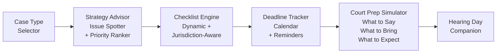

# Pro Se Assistant Toolkit

**Help self-represented litigants win.**

## The Problem

Over 80% of family court cases involve at least one unrepresented party. These litigants face impossible complexity -- byzantine procedures, unfamiliar legal terminology, strict deadlines, and high-stakes outcomes -- with no guidance. The system was designed for lawyers, and without one, most people are set up to fail.

## The Solution

The Pro Se Assistant Toolkit provides case strategy guidance, smart checklists, deadline tracking, and a court preparation simulator. It meets self-represented litigants where they are and walks them through every step -- from identifying their case type to walking into the courtroom prepared.



## Who This Helps

- **Self-represented litigants** -- the 80%+ of family court participants without attorneys
- **Court self-help centers** looking for digital tools to extend their reach
- **Legal aid triage staff** who need to quickly orient new clients
- **Law school clinics** training students while serving real communities

## Features

- **Case type identification and strategy guidance** -- understand your situation and what to prioritize
- **Dynamic checklists by jurisdiction and case type** -- never miss a required document or step
- **Deadline tracking with calendar integration** -- stay on top of filing windows and court dates
- **Court preparation simulator** with practice Q&A -- rehearse before the real thing
- **"Day of court" companion checklist** -- what to bring, what to wear, what to expect
- **Plain-language legal explanations** -- no legalese, just clear answers

## Getting Started

```bash
git clone https://github.com/dougdevitre/pro-se-toolkit.git
cd pro-se-toolkit
npm install
npm run dev
```

## Contributing

See [CONTRIBUTING.md](./CONTRIBUTING.md) for guidelines.

## License

MIT -- see [LICENSE](./LICENSE) for details.
