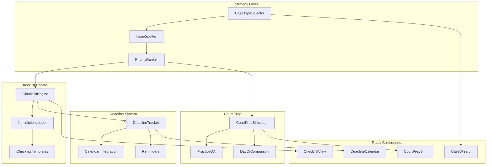
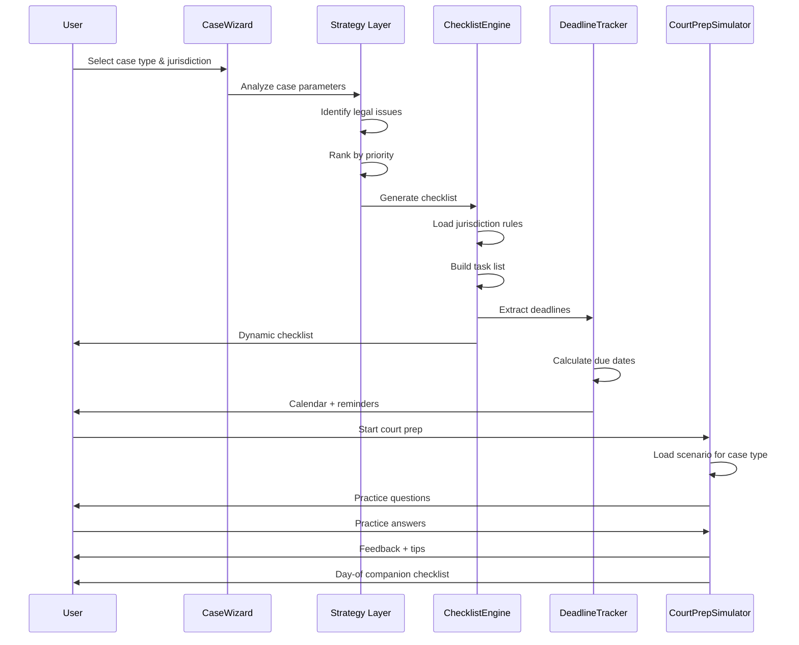
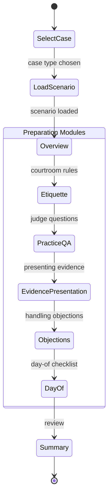
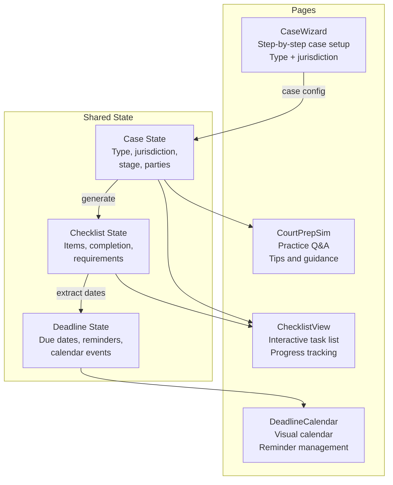

# Pro Se Assistant Toolkit -- Architecture

## System Overview



## Data Flow



## Checklist Generation Flow

```mermaid
flowchart TD
    Start[User selects case type] --> JR{Jurisdiction?}

    JR -->|Missouri| MO[Load MO rules]
    JR -->|California| CA[Load CA rules]
    JR -->|Other| OT[Load state rules]

    MO --> Merge[Merge with case type template]
    CA --> Merge
    OT --> Merge

    Merge --> Stage{Case stage?}
    Stage -->|Pre-filing| PF[Filing requirements<br/>Service rules<br/>Fee waivers]
    Stage -->|Discovery| DS[Disclosure deadlines<br/>Document requests<br/>Interrogatories]
    Stage -->|Pre-hearing| PH[Motion deadlines<br/>Exhibit prep<br/>Witness lists]
    Stage -->|Hearing| HR[Court prep checklist<br/>What to bring<br/>What to say]

    PF --> Validate[Validate completeness]
    DS --> Validate
    PH --> Validate
    HR --> Validate

    Validate --> Output[Dynamic ChecklistItem[]]
```

## Court Prep Simulator Detail



## Component Interaction


